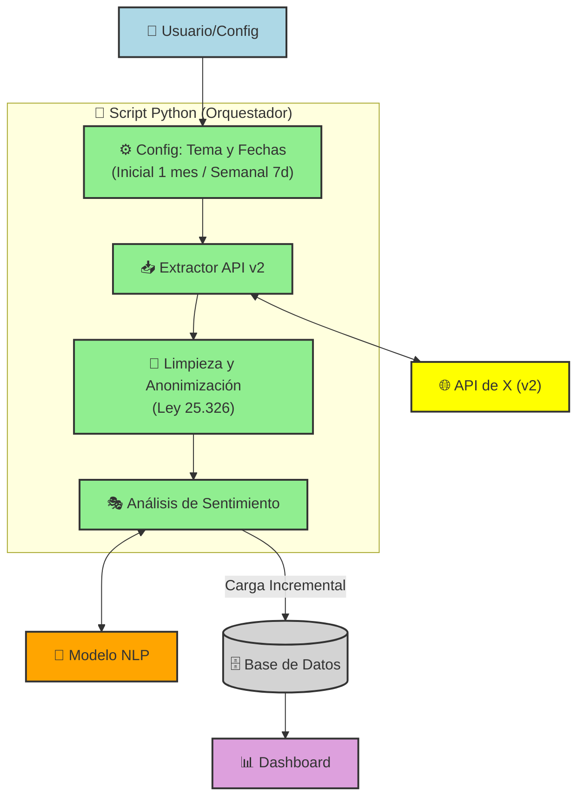

[🔗 Clic aquí para ver el Dashboard en vivo](https://gmgnas.github.io/Sentimientos_X/)

# Analisis de Sentimientos de X

**Materia:** Arquitectura de Soluciones

**Alumnos:** Facundo Zubeldia - Gonzalo Martín González Nastovich

## 1. Objetivo del Proyecto
Desarrollar un flujo de datos (Pipeline) automático para monitorear la percepción pública en la red X, con un historial móvil de 30 días y actualizaciones semanales, cumpliendo con la normativa legal argentina.

## 2.Componentes de la Arquitectura:
   
   * Ingesta: Script Python utilizando la API v2 de X.
   
   * Procesamiento: Clasificación de sentimientos (Positivo, Neutro, Negativo) mediante modelos de NLP.
   
   * Persistencia: Base de datos relacional SQLite para evitar duplicados y mantener integridad.
   
   * Visualización: Dashboard interactivo basado en Plotly, desplegado en infraestructura de GitHub Pages.

##  Arquitectura de la Solución

## 3. Automatización
Se implementó un desacoplamiento mediante config.yaml, permitiendo la reusabilidad del código. La ejecución se gestiona mediante un archivo de procesamiento por lotes (.bat) integrable al programador de tareas del sistema operativo.

## 4. Marco Legal
La solución garantiza la privacidad mediante:

   * Disociación de datos (eliminación de nombres reales).

   * Almacenamiento exclusivo de metadatos de opinión.

   * Cumplimiento de la finalidad estadística solicitada por el cliente.
