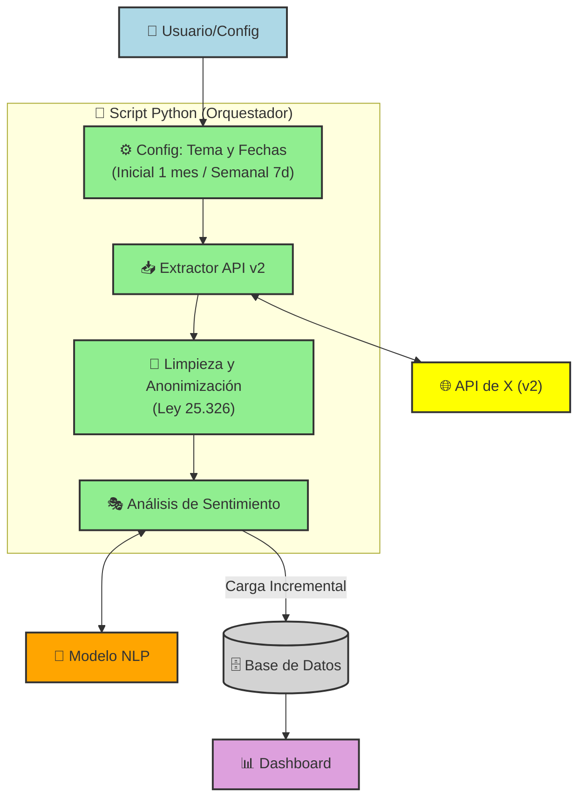

[🔗 Clic aquí para ver el Dashboard en vivo](https://gmgnas.github.io/Sentimientos_X/)

# Analisis de Sentimientos de X

**Materia:** Arquitectura de Soluciones

**Alumnos:** Facundo Zubeldia - Gonzalo Martín González Nastovich

## Descripción del Proyecto
Este sistema realiza una extracción automática de posteos de la red social X, procesa el sentimiento de los mismos y visualiza los resultados en un dashboard interactivo alojado en GitHub Pages.

##  Arquitectura de la Solución

